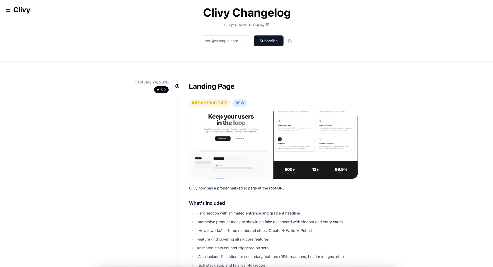
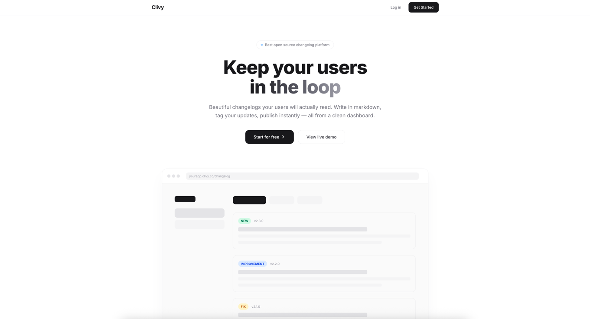
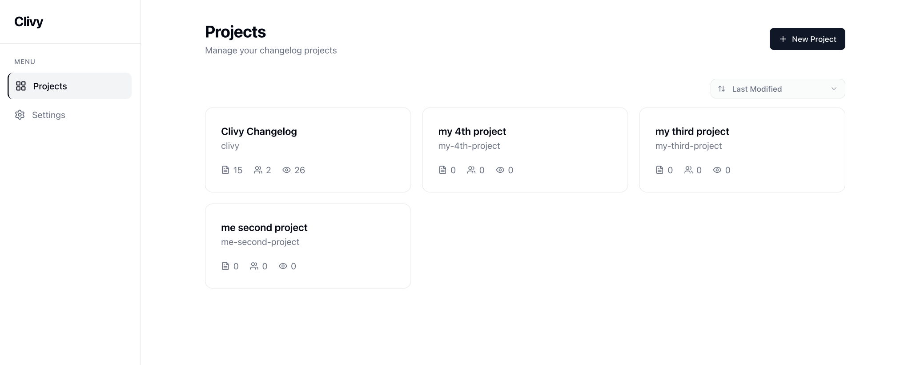
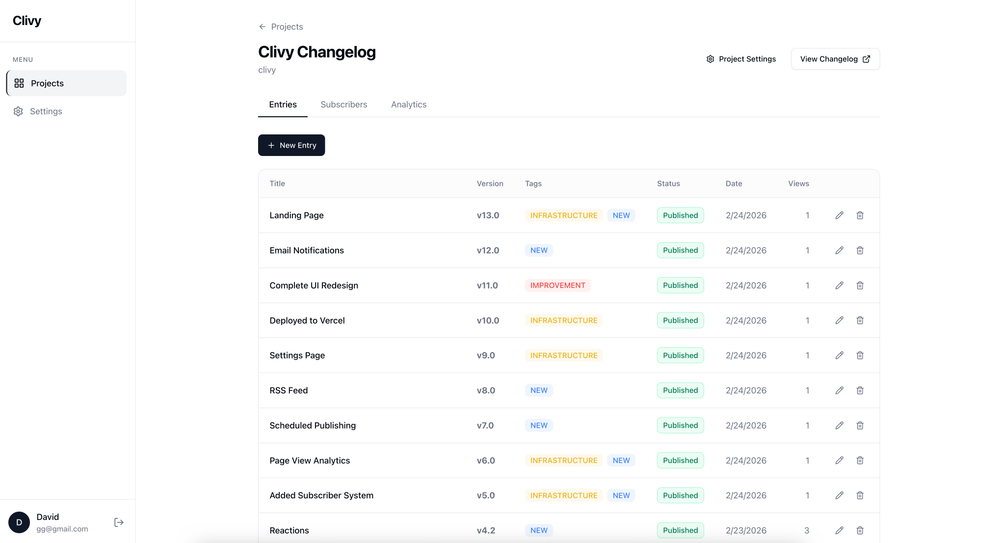
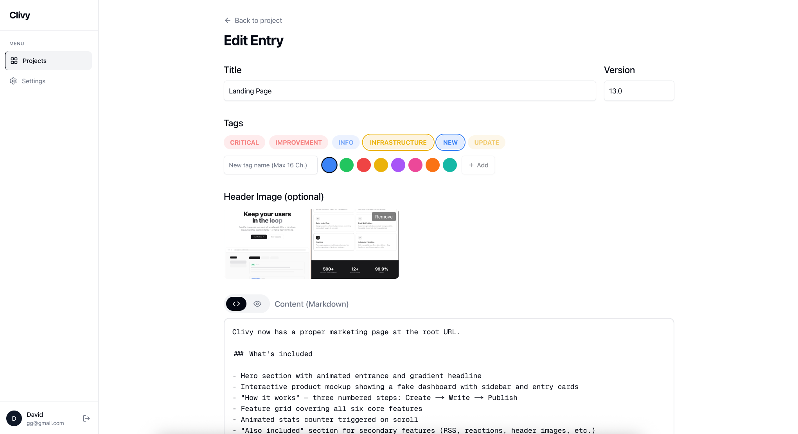
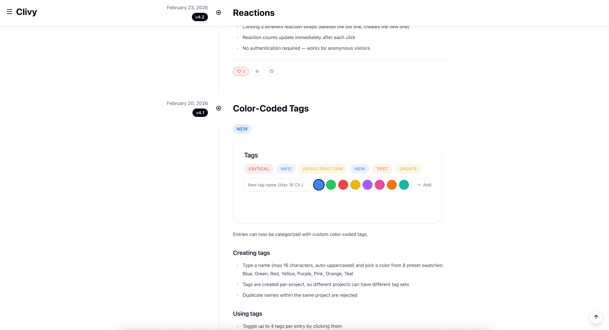
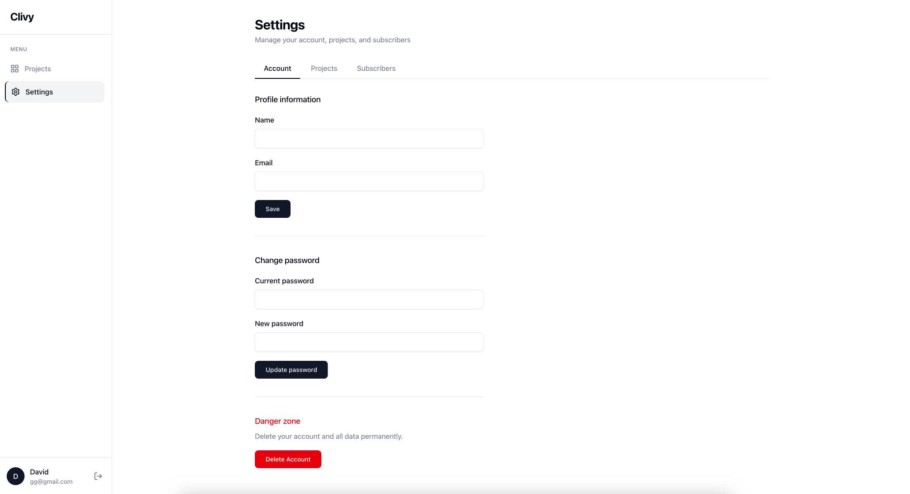

# Clivy — Open Source Changelog Platform

A full-stack changelog and release notes SaaS built with Next.js 16, TypeScript, Prisma 7, and PostgreSQL. Create projects, write entries in markdown, publish to beautiful public pages — all from a clean dashboard.




## Live Demo

[**VIEW LIVE SITE**](https://clivy-one.vercel.app/) · [**VIEW SAMPLE CHANGELOG**](https://clivy-one.vercel.app/changelog/clivy)

---

## Features

**Core**

- Multi-project dashboard with sidebar navigation
- Markdown editor with live preview toggle
- Color-coded custom tags (up to 4 per entry)
- Semantic versioning with previous version hints
- Draft / Publish / Schedule workflow
- Public changelog page with timeline layout

**Engagement**

- [Email Notifications](#email-notifications) — automatic via Resend on publish
- [Reactions](#reactions) — Heart, Downvote, Question (IP-based, one per visitor)
- [Subscribers](#subscribers) — email collection per project with management UI
- [RSS Feed](#rss-feed) — auto-generated per project at `/changelog/{slug}/rss`

**Analytics & Media**

- Page view tracking with IP-based deduplication
- Per-entry view counts and top-performing entry stats
- Header image upload with crop modal (5:2 ratio, auto-compressed)
- Vercel Blob storage for images

**Infrastructure**

- Scheduled publishing via Vercel cron jobs
- Account management (profile, password, delete)
- Project settings (name, slug, website URL)
- Session-based auth with JWT strategy

---

## Tech Stack

| Category    | Technology                |
| ----------- | ------------------------- |
| Framework   | Next.js 16 (App Router)   |
| Language    | TypeScript                |
| Database    | PostgreSQL (Neon)         |
| ORM         | Prisma 7 (pg adapter)     |
| Auth        | NextAuth 4 (Credentials)  |
| Styling     | Tailwind CSS 4            |
| Components  | shadcn/ui + Radix         |
| Animations  | Framer Motion + Lenis     |
| Email       | Resend                    |
| Storage     | Vercel Blob               |
| Deployment  | Vercel                    |

---

## Screenshots

### Landing Page



### Dashboard — Projects



### Project Detail — Entries Table



### Entry Editor — Markdown + Tags + Scheduling



### Public Changelog — Timeline View



### Settings



---

## Getting Started

### Prerequisites

- Node.js 18+
- PostgreSQL database (Neon recommended)

### Installation

```bash
# Clone the repository
git clone https://github.com/davidupdesign/clivy.git

# Navigate to project
cd clivy

# Install dependencies
npm install

# Set up environment variables
cp .env.example .env.local
```

### Environment Variables

Create a `.env.local` file:

```env
# Database
DATABASE_URL=postgresql://...

# Auth
NEXTAUTH_SECRET=your-random-secret
NEXTAUTH_URL=http://localhost:3000

# Vercel Blob (image uploads)
BLOB_READ_WRITE_TOKEN=vercel_blob_...

# Email notifications (optional)
RESEND_API_KEY=re_...
RESEND_FROM_EMAIL=updates@yourdomain.com

# App URL (used in email links)
NEXT_PUBLIC_APP_URL=http://localhost:3000
```

### Database Setup

```bash
# Generate Prisma client
npx prisma generate

# Push schema to database
npx prisma db push
```

### Run Development Server

```bash
npm run dev
```

Open [http://localhost:3000](http://localhost:3000)

---

## Database Schema

```
┌──────────┐     ┌──────────┐     ┌──────────┐
│   User   │────▶│ Project  │────▶│  Entry   │
│          │  1:N│          │  1:N│          │
│ id       │     │ id       │     │ id       │
│ email    │     │ name     │     │ title    │
│ password │     │ slug     │     │ body     │
│ name     │     │ logo     │     │ version  │
└──────────┘     │ website  │     │ status   │
                 └──────────┘     │ pinned   │
                      │           │ headerImg│
                      │           └──────────┘
                      │                │
                 ┌────┴────┐     ┌─────┴─────┐
                 │   Tag   │◀──▶│  Entry    │  (many-to-many)
                 │         │     └───────────┘
                 │ name    │           │
                 │ color   │     ┌─────┴─────┐
                 └─────────┘     │ Reaction  │
                      │          │ emoji     │
                 ┌────┴─────┐    │ ip        │
                 │Subscriber│    └───────────┘
                 │ email    │          │
                 │ phone    │    ┌─────┴─────┐
                 │ channel  │    │ PageView  │
                 │ active   │    │ ip        │
                 └──────────┘    └───────────┘
```

7 models with cascading deletes. Entries support draft, published, and scheduled statuses.

---

## Project Structure

```
├── prisma/
│   └── schema.prisma           # Database schema (7 models)
├── src/
│   ├── app/
│   │   ├── page.tsx            # Landing page
│   │   ├── (auth)/
│   │   │   ├── login/          # Login page
│   │   │   └── signup/         # Signup page
│   │   ├── dashboard/
│   │   │   ├── page.tsx        # Projects list
│   │   │   ├── new-project/    # Create project
│   │   │   ├── settings/       # Account, projects, subscribers
│   │   │   └── [projectId]/
│   │   │       ├── page.tsx    # Project detail (entries/subscribers/analytics)
│   │   │       ├── new/        # New entry editor
│   │   │       ├── [entryId]/edit/  # Edit entry
│   │   │       └── settings/   # Project settings
│   │   ├── changelog/
│   │   │   └── [slug]/
│   │   │       ├── page.tsx    # Public changelog page
│   │   │       └── rss/        # RSS feed route
│   │   └── api/
│   │       ├── auth/           # NextAuth + signup
│   │       ├── projects/       # CRUD
│   │       ├── entries/        # CRUD + latest-version
│   │       ├── tags/           # CRUD
│   │       ├── reactions/      # Toggle reactions
│   │       ├── subscribers/    # Subscribe + manage
│   │       ├── views/          # Page view tracking
│   │       ├── upload/         # Vercel Blob upload
│   │       ├── image-proxy/    # CORS proxy for URL images
│   │       ├── user/           # Profile, password, delete account
│   │       └── cron/publish/   # Scheduled publishing
│   ├── components/
│   │   ├── sidebar.tsx         # Dashboard sidebar nav
│   │   ├── dashboard-tabs.tsx  # Animated tab switcher
│   │   ├── changelog-timeline.tsx  # Public timeline with sticky headers
│   │   ├── changelog-navbar.tsx    # Public page nav with dropdown
│   │   ├── reactions.tsx       # Heart/Downvote/Question reactions
│   │   ├── subscribe-form.tsx  # Email subscription widget
│   │   ├── image-upload-field.tsx  # Upload + URL + crop
│   │   ├── image-crop-modal.tsx    # 5:2 aspect crop with zoom
│   │   ├── smooth-scroll.tsx   # Lenis smooth scrolling
│   │   ├── scroll-to-top.tsx   # Floating scroll button
│   │   └── ui/                 # shadcn/ui components
│   └── lib/
│       ├── prisma.ts           # Prisma client (pg adapter)
│       ├── auth.ts             # NextAuth config
│       ├── notifications.ts    # Email notification logic
│       ├── resend.ts           # Resend client
│       ├── crop-image.ts       # Canvas-based image cropping
│       └── utils.ts            # cn() utility
└── vercel.json                 # Cron job config
```

---

## How It Works

```
┌───────────────┐      ┌────────────────┐      ┌──────────────────┐
│  Create a     │ ───▶ │  Write entry   │ ───▶ │  Publish or      │
│  project      │      │  in markdown   │      │  schedule it     │
│  (name + slug)│      │  + tags, image │      │                  │
└───────────────┘      └────────────────┘      └──────────────────┘
                                                        │
                              ┌──────────────────────────┘
                              ▼
                 ┌──────────────────────┐
                 │  Public changelog    │
                 │  /changelog/{slug}   │
                 │                      │
                 │  • Timeline layout   │
                 │  • Sticky headers    │
                 │  • Reactions         │
                 │  • Subscribe form    │
                 │  • RSS feed          │
                 └──────────────────────┘
```

---

## Key Features Explained

### Email Notifications

When an entry is published, all active email subscribers for that project receive a branded notification via Resend. Emails include a markdown snippet and a link to the full changelog. Sent in batches of 100 with deduplication guards.

### Reactions

Each entry supports three reactions: Heart, Downvote, and Question (using Lucide icons). Visitors get one reaction per entry, tracked by IP. Clicking the same reaction toggles it off; clicking a different one swaps.

### Subscribers

Public changelog pages include an email subscription form. The dashboard shows subscriber counts per project with the ability to remove individual subscribers. Supports reactivation if a previously unsubscribed email re-subscribes.

### RSS Feed

Every project automatically gets an RSS feed at `/changelog/{slug}/rss`. Standard RSS 2.0 format with entry titles, versions, markdown content, and publication dates.

### Scheduled Publishing

Entries can be scheduled for a future date and time. A Vercel cron job runs daily at midnight, finds all entries with `status: "scheduled"` and `publishedAt <= now`, publishes them, and triggers email notifications.

### Header Images

Entries support optional header images. Upload a file (max 10MB, auto-compressed to 1MB) or paste a URL. Images pass through a crop modal with a fixed 5:2 aspect ratio and adjustable zoom. Stored in Vercel Blob.

---

## Scripts

```bash
npm run dev      # Start development server
npm run build    # Build for production
npm run start    # Start production server
npm run lint     # Run ESLint
```

---

## Deployment

Deploy to Vercel:

```bash
vercel
```

The `vercel.json` includes a cron job configuration for scheduled publishing:

```json
{
  "crons": [
    {
      "path": "/api/cron/publish",
      "schedule": "0 0 * * *"
    }
  ]
}
```

Required: set all environment variables in Vercel dashboard. Add `serverExternalPackages: ["@prisma/client", "pg"]` in `next.config.ts` (already configured).

---

## Author

David K — [GitHub](https://github.com/davidupdesign)
